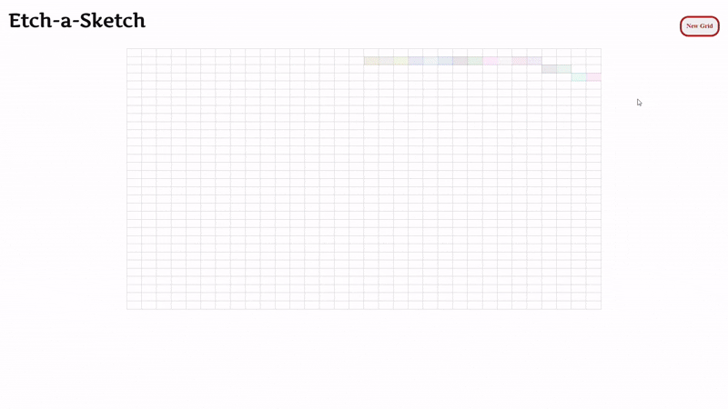

# Etch-a-Sketch 🎨

A fun, interactive browser-based Etch-a-Sketch app!  
Draw by hovering over the grid, and watch the colors and opacity change as you go.  
Customize your grid size for endless creativity.

## ✨ Features

- **Dynamic Grid:** Choose your grid size (up to 100x100).
- **Colorful Drawing:** Hover over blocks to color them randomly.
- **Opacity Effect:** Each pass over a block increases its opacity, revealing richer colors.
- **Responsive UI:** Clean, simple interface with a modern look.

## 🚀 Getting Started

1. **Clone or Download** this repository.
2. Open `index.html` in your web browser.
3. Click the **New Grid** button to set your grid size and start drawing!

## 🖥️ Demo

  
<!-- Add a demo GIF or screenshot here if available -->

## 🛠️ How It Works

- The grid is generated dynamically based on user input.
- Each block changes to a random color on first hover, then increases in opacity with each additional hover.
- Click **New Grid** to reset and choose a new grid size.

## 📁 Project Structure

```
Etch-a-Sketch/
│
├── index.html      # Main HTML file
├── styles.css      # Styling for the app
├── script.js       # App logic
└── README.md       # Project info
```

## 📚 Technologies Used

- HTML5
- CSS3 (with Google Fonts)
- JavaScript (ES6)

## 🙌 Credits

Created by Ghulam Mustafa Bhatti  
Inspired by The Odin Project's Foundations curriculum.

## 📄 License

This project is for educational and personal use.

---

Enjoy